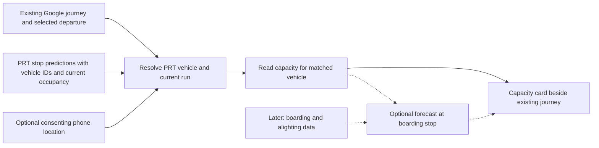

# Architecture: a capacity addition to an existing journey

Read [PROJECT](PROJECT.md) first. Recommended baseline: one Next.js/TypeScript mobile web frontend and API. Reuse Google Maps JS for the map canvas. Persistence is MongoDB Atlas with a time-series `stopEvents` collection; the earlier Postgres option is superseded ([ADR-0001](adr/0001-mongodb-for-mock-timeseries.md)). Consumers read through a `CapacitySource` abstraction so live PRT ingestion can replace the mock source without a schema change. Domain vocabulary lives in [CONTEXT](../CONTEXT.md). This is a proposed interface; no runtime or integration exists yet.



## Four different facts

| Fact | How to establish it |
| --- | --- |
| Vehicle identity | Agency fleet ID plus trip/service-day context; a route number is insufficient. |
| Total capacity | Verified metadata for that vehicle/configuration, with a defined seating or total-passenger basis. It is not the current passenger count. |
| Current occupancy | Agency passenger-load feed, an actual passenger sensor, or a clearly labeled rider observation. GPS alone does not supply it. |
| Occupancy at the rider's stop | A separate prediction using current occupancy and expected boarding/alighting before that stop. It can change while the bus approaches. |

An exact ratio requires a numerator and denominator with compatible meanings. A capacity category cannot be converted into a passenger count. Rated capacity also does not guarantee how many people a driver can board at a particular stop.

## First feasibility check: real capacity data

PRT's developer portal describes an API access request and real-time feeds. The supplied [BusTime v3 guide](../DeveloperAPIGuide3_0.pdf), Get Vehicles and Get Predictions sections, documents `psgld` categories `FULL`, `HALF_EMPTY`, `EMPTY`, and `N/A`; thresholds are agency-defined and `N/A` means unknown. **Live PRT population of this field is still unverified.** Preserve its raw value; do not interpret HALF_EMPTY as exactly 50% or EMPTY as zero passengers. The passenger-load field in Get Predictions still describes current load, not a forecast of occupancy at arrival. [PRT resources](https://www.rideprt.org/business-center/developer-resources/), [online API guide](https://realtime.portauthority.org/bustime/apidoc/docs/DeveloperAPIGuide3_0.pdf).

Start with `getpredictions` for a verified boarding-stop ID and route (`stpid` plus `rt`, with `format=json`). It returns vehicle ID (`vid`), arrival/departure time (`prdtm`), trip context, and current passenger load (`psgld`) together. Use `getvehicles` only when coordinates or additional vehicle context are needed. The guide documents categories, not numeric passenger counts or rated capacity. [BusTime guide](../DeveloperAPIGuide3_0.pdf), printed pp. 9–11, 25–28.

Spend the first 20–30 minutes obtaining sanitized authenticated samples for several vehicles: vehicle ID, trip/service date, provider timestamp, and passenger-load values. Check missing-value semantics and coverage across samples; example payloads do not prove live PRT availability. Record the verified API base URL. The guide requires an approved API key and gives a default limit of **10,000 requests per key per day**; access timing and PRT's actual configuration remain unverified. [BusTime guide](../DeveloperAPIGuide3_0.pdf), printed pp. 1–2. A static GTFS schedule or an optional field does not demonstrate live counts. [GTFS-Realtime reference](https://gtfs.org/documentation/realtime/reference/#message-vehicleposition).

Decision: usable counts plus compatible capacity allow a numeric visual; usable categories allow a categorical visual; unavailable or stale data yields an explicit unknown/stale state. If access is blocked, use labeled fixtures to build the card/contract while keeping the unresolved live-data dependency visible. Do not quietly substitute participating-phone counts. Rider observations are a possible explicitly chosen fallback, not an automatic expansion into a reporting platform.

## Join Google to the correct bus

Google can supply walking/transit legs, stops, departure times, line names, and headsigns. Its documented `TransitVehicle` describes vehicle type/name; do not treat that object or a label like 71D as a PRT fleet ID. [Google transit routes](https://developers.google.com/maps/documentation/routes/transit-route), [TransitVehicle reference](https://developers.google.com/maps/documentation/javascript/reference/route#TransitVehicle).

Consume the selected leg from the existing integration. If the starting point is the consumer Google Maps app, do not assume it exposes its selected trip to our app automatically. The proposed product integration uses Google's routing APIs in our frontend; an initial manual selection from a known journey is a disclosed shortcut. Capacity is rendered in our frontend, not promised as a new control inside the consumer Google Maps app.

Normalize agency, route label, headsign/direction, boarding-stop name/coordinates, and departure time. Match these to PRT stop/route metadata and live departures, preserving the existing journey. Use a verified stop mapping and a time tolerance based on actual samples; never join on route alone. Return candidate vehicles when the match is ambiguous. Two adjacent buses on the same route must remain separate.

Use an opaque run key derived from provider + vehicle ID + provider trip ID + service date, adjusted to verified feed semantics. Never carry occupancy into the vehicle's next trip. If stable identity cannot be established, return unresolved rather than guessing.

## What phone tracking can contribute

An opt-in phone location stream can be compared with candidate bus positions, movement, direction, and timing across multiple samples. It can suggest that the phone is riding a particular vehicle. Require confirmation when buses are close or confidence is insufficient. A bus-ID selection/scan identifies the vehicle but still does not measure its passengers.

Browser location updates require permission and a secure context. Start with an explicitly active foreground session; do not promise continuous background tracking from a web page. Keep raw trajectories out of persistent storage unless a concrete task requires them. [Geolocation API](https://developer.mozilla.org/en-US/docs/Web/API/Geolocation/watchPosition).

Ten matched phones means ten participating devices, not necessarily ten passengers. Estimating total riders from participating devices would require a known, validated participation rate and handling duplicate devices and departure detection. That evidence does not exist here. Phone participation may be displayed separately with its correct label; it must never populate the passenger-count field.

## Minimal shared contract

Create `src/lib/contracts.ts` and one matching fixture before independent consumers diverge. That code becomes canonical once implemented; do not independently rename this proposed contract. IDs are strings and timestamps are ISO UTC. Keep live and demo namespaces separate.

```ts
type CapacityReading =
  | { kind: "count"; passengers: number; totalCapacity: number | null }
  | { kind: "percentage"; percent: number }
  | { kind: "category"; value: "low" | "some_space" | "full"; providerValue: string }
  | { kind: "unknown" };

type CapacityCard = {
  mode: "live" | "demo";
  runKey: string;
  vehicleId: string;
  routeLabel: string;
  boardingStopId: string;
  expectedAtStop: string | null;
  current: {
    reading: CapacityReading;
    source: "agency" | "sensor" | "rider" | "none";
    observedAt: string | null;
    feedUpdatedAt: string | null;
    state: "fresh" | "stale" | "age_unknown" | "conflicting" | "unknown";
  };
  atStop:
    | { kind: "unavailable" }
    | {
        kind: "forecast";
        reading: CapacityReading;
        predictedFor: string;
        generatedAt: string;
        modelVersion: string;
        uncertainty: string;
      };
};
```

- `POST /api/capacity/resolve` accepts `{ agency, routeLabel, headsign, boardingStop: { name, lat, lng }, departureAt }`. Return `{ status: "matched" | "ambiguous" | "unavailable", candidates: [{ runKey, vehicleId, routeLabel, headsign, boardingStopId, expectedAtStop }] }`. A matched response has exactly one candidate; an unavailable response has none. This resolves an existing leg; it does not plan a route.
- `GET /api/capacity?runKey=...&boardingStopId=...` returns `CapacityCard` for a verified active run and stop. Pass through provider ETA; do not develop an ETA engine. A present vehicle with no occupancy returns a successful card with unknown capacity.
- Errors: `{ error: { code, message, retryable } }`. Use HTTP 400 for invalid input, 409 for invalid/expired run association, 429 for rate limits, and 503 when the provider is unavailable and no usable cached record exists. Do not mislabel a provider outage as an empty bus.
- `observedAt` is the occupancy measurement time, or null when unknown. BusTime vehicle `tmstmp` is the last positional update; prediction `tmstmp` is prediction generation time. Store these as `feedUpdatedAt`, never as occupancy measurement time or local fetch time. Label them "Feed updated" in the UI. A reported load with unknown measurement age uses `age_unknown`; retain the category but qualify its age. A fresh feed timestamp does not prove fresh occupancy. [BusTime guide](../DeveloperAPIGuide3_0.pdf), printed pp. 10, 26–27.
- Start with a 90-second stale threshold, a prototype constant to validate. An old feed or known old occupancy observation marks a reading stale; only a verified recent occupancy observation can mark it fresh. Missing load remains unknown; conflicting reports remain conflicting. Stale, conflicting, or unverified-age readings never imply guaranteed available room. Unknown provider codes remain unknown.
- Initial adapter mapping: EMPTY → low, HALF_EMPTY → some_space, FULL → full, N/A/missing/unrecognized → unknown. Retain the agency code. Numeric values require real numeric fields; never manufacture them from these categories or session counts.
- Ratio display is enabled only for verified count plus positive compatible capacity. With count alone, display the count and unknown total; with percentage/category alone, show that representation. Unsupported numbers are absent, not zero.

## Forecasting is a separate, later capability

Conceptually: occupancy at arrival = current occupancy + boardings − alightings before the rider's stop. GPS/ETA can identify the intervening time/stops; they do not supply those passenger flows. Current load cannot simply be relabeled a future prediction.

Only enable `atStop.kind = "forecast"` after obtaining suitable observations/history, defining the predicted event/time, and evaluating against held-out trips or observed arrivals. Compare with a last-reading baseline and disclose uncertainty. Otherwise return `unavailable` and show only the timestamped current load. Keep this out of the first capacity milestone.

## Runtime and verification

Poll our capacity endpoint about every five seconds; never translate each browser poll into a provider call. Coalesce upstream reads across clients at an initial 20-second cadence and bound requests to five seconds. Two provider requests every 20 seconds already consume 8,640 of the default 10,000 daily requests; budget across all routes, stops, and callers. Batch up to 10 stop IDs per `getpredictions` request, optionally filtered by route, or up to 10 vehicle IDs; do not combine `stpid` with `vid`. `getvehicles` accepts up to 10 vehicle IDs or route IDs, not both. Request `tmres=s`; predictions also support `unixTime=true` for UTC epoch milliseconds. These are guide capabilities, to verify against PRT. [BusTime guide](../DeveloperAPIGuide3_0.pdf), printed pp. 2, 9, 25–28.

Match cache/storage to the deployment model; process memory is not shared across serverless instances. Shared persistence is MongoDB Atlas per [ADR-0001](adr/0001-mongodb-for-mock-timeseries.md); no queues or separate orchestration service.

Keep API keys server-side. Planned settings: verified `PRT_API_BASE_URL`, required `PRT_API_KEY`, `GOOGLE_MAPS_API_KEY` for the server routing adapter when used, and `DATA_MODE`. Database settings are needed only if persistence is selected. Runtime pins, install/dev/check/deploy commands, credentials, and hosting are not configured yet. Publish actual commands when the scaffold exists.

Tests to implement: same-route buses do not share load; an ambiguous match stays unresolved; a trip change clears prior association; N/A and unknown codes never render empty; categorical data never becomes a numeric ratio; stale/failed feeds stay visible; a fresh prediction or GPS timestamp cannot establish fresh occupancy; browser polls share quota-bounded provider reads; phone sessions never become passenger counts; arrival forecasts stay unavailable without a predictor; selecting another journey selects its matched vehicle; live/demo data never mix. These are acceptance criteria, not tests already passed.
