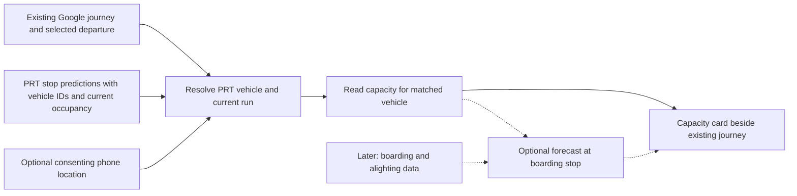

# Architecture

## Trip planning, chat and shared state (current, issue #20)

```mermaid
flowchart LR
  UI[origin · destination · time · prefs] --> CTX[lib/app-context: one trip state]
  CHAT[ChatSheet] --> API_C[/api/chat]
  API_C --> G[lib/chat/guided.ts parser]
  API_C --> M[lib/chat/model.ts Claude tools]
  G & M --> X[lib/chat/execute.ts: planTrip]
  X --> J[lib/journey/motis.ts → Transitous]
  X --> P[lib/pressure/service.ts]
  API_C -->|validated ChatAction[]| CTX
  CTX --> H[useJourneys → /api/journey → motis.ts]
  CTX --> PR[usePressure → /api/pressure]
  H --> MAP[MapCanvas legs · JourneyPanel · arrival tiles]
  PR --> MOD[PressureModule · /plan timeline · explain.ts]
```

### Shared trip state (`lib/app-context.tsx`)

`destination`, `manualOrigin` (null = device location or CMU fallback), `departureAt` + `arriveBy`, `prefs {maxWalkMinutes, maxTransfers}`, `selectedJourneyId`, `riderSignals`, `chatOpen`, plus the earlier `demo`, `viewMode`, `selectedRouteId`. Changing destination, time or prefs clears the journey selection; `pickJourney()` falls back to the first fresh option when a selected id disappears.

### Journeys (`lib/journey`)

- Provider: **Transitous** (public MOTIS instance over PRT GTFS; key-free; identifying `User-Agent` sent; verified 2026-09-12 with PRT stop ids and routes such as 61C and RED). `motis.ts` validates every leg (mode, places, times, polyline) and drops any itinerary with an unusable leg; walking-only `direct` results are offered once, never synthesized.
- Contract (`types.ts`): `Journey { id, startTime, endTime, durationSeconds, transfers, walkSeconds, rideSeconds, waitSeconds, realTime, legs[] }`, `JourneyLeg { mode WALK|BUS|RAIL|TRAM|OTHER, from/to {name, stopId, lat, lng, at, scheduledAt}, routeShortName, headsign, agency, realTime, intermediateStops, geometry[] }`. `waitSeconds = duration − walk − ride`. `realTime` is true only when the provider flagged a transit leg realtime; the UI labels arrivals "estimate · realtime PRT | scheduled".
- Endpoint: `GET /api/journey?flat&flng&tlat&tlng[&at=ISO][&arriveBy=1][&maxWalk=3..45][&maxTransfers=0..4]` → `JourneyResponse` (`ok | empty | error`), 400 on bad input, 503 on provider failure, in-process cache 45 s keyed to the minute. `useJourneys()` re-polls "leave now" every 60 s and applies **latest request wins** (`acceptResponse`, tested) so a slow older search never overwrites a newer selection.
- Map: `MapCanvas` is interactive (pan, pinch/scroll zoom with `cooperativeGestures`, no rotation, zoom ≤ 17 over the z16 raster); the SVG overlay re-projects on every `move` frame. Camera moves only on locate, zoom, "Fit route", a new destination, or a new journey id — never on a data refresh. The three tracked route lines hide while a journey is drawn.

### Chat planner (`lib/chat`, `app/ChatSheet.tsx`, `POST /api/chat`)

- Request `{ messages[], trip: TripContext, pending }` → response `{ reply, actions: ChatAction[], journeyIds, options, pending, mode: "model"|"guided", fallback? }`. `GET /api/chat` reports the mode and the exact setup needed.
- Actions are the only way chat changes the app: `set_origin`, `set_destination`, `set_time`, `set_prefs`, `select_journey` (must name a real journey id), `add_rider_signal`, `open_timeline`. `actions.ts` validates every one (Pittsburgh bounds, ≤ 48 h, walking 3–45 min, transfers 0–4, sanitized text).
- `guided.ts` (no key): lexicon of ~45 Pittsburgh places with aliases, explicit ambiguities ("the museum", "the stadium" …) that ask instead of guessing, Photon fallback for addresses, Pittsburgh-local time phrases (`time.ts`), follow-ups (later/earlier, less/more walking, no transfers, after the event, pick option N), why/what's-happening explanations from `explain.ts`, rider reports. `model.ts` (key set): `claude-opus-5`, effort low, server-side refusal fallbacks enabled, tools `resolve_place`, `plan_trip`, `explain_time`, `after_event`, `report_cause`, `select_journey`, `ask_rider`; the loop runs the same executors and the same validation; on any API failure the guided parser answers and the response carries `fallback`.
- Rider text and event descriptions are untrusted: sanitized, bounded, never executed as instructions.

### Pressure additions (additive to the #19 contract)

- `EventCategory` adds FESTIVAL, CONVENTION, CAMPUS, THEATER, OTHER; `EventSignal.evidence: VERIFIED | RIDER`; `RiderSignal` (validated by `rider-signals.ts`, capped at MEDIUM magnitude, end always estimated, labeled unverified).
- `DemandReason.eventId?` and `.detail?` (forecast values, venue/phase/source, alert text, evidence weight) give each timeline sample its own evidence; `PressureResult.events[]` (all in-reach events considered) and `coverageGaps[]` (what this run could not see).
- `POST /api/pressure` = GET query + `{ riderSignals }` body; `usePressure` switches to POST when rider signals exist. `explain.ts` (`explainSample`, `dayTitle`) is the single source for the "What's happening" section and chat explanations.
- Ticketmaster now uses the venue's own coordinates and a 15-mile radius; sports feeds keep the venue table.

### Interactive vehicle view (`app/VehicleModelView.tsx`, issue #22)

- `ViewMode` is `map | list | vehicle`; the top-right `ViewToggle` control switches between the three visual views without changing the selected trip, journey, selected route, or pressure result. List mode is the trip routing module for selecting a bus route: `app/RouteListView.tsx` shows the selected journey's legs when one exists, or the three tracked routes with live PRT times as a radio group otherwise (see "Real arrival predictions" below); selecting a route or leg there is the same `selectedRouteId`/`journey` state the map and chat read.
- Vehicle mode loads Three.js, `GLTFLoader` and `OrbitControls` only after it is opened. The 1.7 MB GLB and two poster fallbacks are local under `public/models`, so the demo does not depend on a model CDN. A failed WebGL context keeps the supplied poster visible instead of leaving a blank panel.
- The supplied GLB has named roof, side-panel, articulation-pivot and bellows nodes but no baked clips or passengers. `lib/vehicle-model.ts` supplies the tested reveal phases and bellows interpolation; the viewer animates roof removal before the side/window panels, keeps the accordion visible, and caps bend at ±30°. Rotation pauses for `prefers-reduced-motion`; drag/pinch and keyboard arrows remain available.
- This is an illustrative XD60 concept, not a verified PRT fleet configuration or engineering model. It does not read `/api/pressure`, turn the model index into passengers, or claim occupancy/capacity. That separation is always visible in the panel.

### Verification

`components/InsightCards.tsx` supplies horizontal 168px square cards with scroll controls and one expandable detail panel; `PressureInsights.tsx` turns existing per-sample evidence into concise snapshots without contribution values. Home Advice puts `lib/journey/recommendation.ts`'s quickest returned BUS itinerary first (duration, transfers, walking); its action selects the shared journey, switches to map mode, and scrolls/focuses the map. Recommendations rank only the current provider search, not alternate pressure departure windows. `app/plan` resets card details when the selected sample changes. No API/model contract changes. `scripts/qa-insights.mjs` verifies this with explicit UI fixtures at 320/390/768/1280px, including missing routing.

`npm test` (pressure, adapters, journey, chat, explain, crowding, vehicle reveal/articulation), typecheck, lint, build; foreground `npm start -- --port 3100` then `qa-screens`, `qa-flow`, `qa-fail`, `qa-menu`, `qa-journey`, `qa-vehicle` (local GLB load → pause/reveal/bend → Map/List/Vehicle remount → console checks) (chat → cards → map/ETA consistency → pan/zoom/fit → bar evidence → routing 503, chat 503, denied geolocation).

## Transit Pressure (issue #19)

Canonical code: `busappfrontend/lib/pressure`. Providers stay server-side; React consumes `PressureResult` through `usePressure()`.

```mermaid
flowchart LR
  UI[destination + time] --> API[/api/pressure]
  API --> S[service.ts: SignalBundle]
  E[events: MLB · NHL · ESPN · Ticketmaster?] --> S
  W[Open-Meteo hourly] --> S
  G[GTFS snapshot departures] --> S
  R[PRT GTFS-RT protobuf: delays · alerts · vehicles] --> S
  D[demo.ts scenarios] --> S
  S --> M[engine.ts pure model]
  M --> P[PressureResult: score · level · confidence · timeline · surge · bestWindow · reasons · eventImpacts · freshness]
  P --> H[PressureModule · PressureTimeline · DemoBar · MapCanvas marker]
```

### Contract (`lib/pressure/types.ts`)

- `SignalBundle { mode, generatedAt, location, destination?, events[], weather[], transit, departures[], freshness[] }` is the only engine input. Demo and live produce the same shape.
- `PressureResult { current, timeline[], surge | null, bestWindow, recommendation {kind,label,detail,at}, eventImpacts[], freshness[], coverage, stepMinutes, mode, modelVersion }`. `score` is a 0–100 model index. `DemandReason {type: TIME|EVENT|WEATHER|TRANSIT|SERVICE, label, contribution}` explains every point.
- `DataFreshness.status ∈ LIVE | STALE | FALLBACK | UNAVAILABLE | DEMO` describes data, not the model. Confidence (`HIGH|MEDIUM|LOW`) is derived from it plus horizon.

### Endpoint

`GET /api/pressure` — LIVE: `lat,lng` (Pittsburgh bounds; omitted = CMU), optional `dlat,dlng` (corridor end), `at` (ISO with zone, −5 min … +48 h), `horizon` (15–480 min). DEMO: `mode=DEMO&scenario=pirates|concert|cmu&stage=n[&at]`. Errors `{error}` with 400; 503 when the live model itself fails. `Cache-Control: no-store`; provider reads are cached/coalesced in-process (`providers/http.ts`).

### Model

Weights and thresholds live only in `lib/pressure/config.ts`; the formula and assumptions are documented in the [overnight report](overnight-report.md). Tests: `scripts/pressure.test.mjs` (relationships the model must satisfy) and `scripts/adapters.test.mjs` (parsers reject malformed input, null weather is missing not zero, GTFS calendar/exception logic).

### Rules

Never display the index as occupancy. Never infer counts from categories. Event end times are estimates and say so. A missing provider lowers confidence and omits its term; it never invents an observation. Keep this section current when the contract changes; the capacity contract below remains the reference for any future occupancy feature.

---

## Earlier: a capacity addition to an existing journey (deferred)

Read [PROJECT](PROJECT.md) first. Recommended baseline: one Next.js/TypeScript mobile web frontend and API. Reuse Google for routing and PRT for vehicle data. Add shared Postgres only when persistence is needed for reports or forecasting history. This is a proposed interface; no runtime or integration exists yet.



## Four different facts

| Fact | How to establish it |
| --- | --- |
| Vehicle identity | Agency fleet ID plus trip/service-day context; a route number is insufficient. |
| Total capacity | Verified metadata for that vehicle/configuration, with a defined seating or total-passenger basis. It is not the current passenger count. |
| Current occupancy | Agency passenger-load feed, an actual passenger sensor, or a clearly labeled rider observation. GPS alone does not supply it. |
| Occupancy at the rider's stop | A separate prediction using current occupancy and expected boarding/alighting before that stop. It can change while the bus approaches. |

An exact ratio requires a numerator and denominator with compatible meanings. A capacity category cannot be converted into a passenger count. Rated capacity also does not guarantee how many people a driver can board at a particular stop.

## First feasibility check: real capacity data

PRT's developer portal describes an API access request and real-time feeds. The supplied [BusTime v3 guide](../DeveloperAPIGuide3_0.pdf), Get Vehicles and Get Predictions sections, documents `psgld` categories `FULL`, `HALF_EMPTY`, `EMPTY`, and `N/A`; thresholds are agency-defined and `N/A` means unknown. **Live PRT population of this field is still unverified.** Preserve its raw value; do not interpret HALF_EMPTY as exactly 50% or EMPTY as zero passengers. The passenger-load field in Get Predictions still describes current load, not a forecast of occupancy at arrival. [PRT resources](https://www.rideprt.org/business-center/developer-resources/), [online API guide](https://realtime.portauthority.org/bustime/apidoc/docs/DeveloperAPIGuide3_0.pdf).

Start with `getpredictions` for a verified boarding-stop ID and route (`stpid` plus `rt`, with `format=json`). It returns vehicle ID (`vid`), arrival/departure time (`prdtm`), trip context, and current passenger load (`psgld`) together. Use `getvehicles` only when coordinates or additional vehicle context are needed. The guide documents categories, not numeric passenger counts or rated capacity. [BusTime guide](../DeveloperAPIGuide3_0.pdf), printed pp. 9–11, 25–28.

Spend the first 20–30 minutes obtaining sanitized authenticated samples for several vehicles: vehicle ID, trip/service date, provider timestamp, and passenger-load values. Check missing-value semantics and coverage across samples; example payloads do not prove live PRT availability. Record the verified API base URL. The guide requires an approved API key and gives a default limit of **10,000 requests per key per day**; access timing and PRT's actual configuration remain unverified. [BusTime guide](../DeveloperAPIGuide3_0.pdf), printed pp. 1–2. A static GTFS schedule or an optional field does not demonstrate live counts. [GTFS-Realtime reference](https://gtfs.org/documentation/realtime/reference/#message-vehicleposition).

Decision: usable counts plus compatible capacity allow a numeric visual; usable categories allow a categorical visual; unavailable or stale data yields an explicit unknown/stale state. If access is blocked, use labeled fixtures to build the card/contract while keeping the unresolved live-data dependency visible. Do not quietly substitute participating-phone counts. Rider observations are a possible explicitly chosen fallback, not an automatic expansion into a reporting platform.

### Implemented narrow observation: 71B at stop 3141 (#23)

`lib/crowding` implements a deliberately narrower current-observation path without reviving the superseded capacity-first product. `app/api/crowding/route.ts` reads 71B inbound predictions for Fifth Ave + College (stop 3141), coalescing all browser polls into at most one upstream request per 20 seconds. With a server-only `PRT_API_KEY`, it uses BusTime v3 `getpredictions`; otherwise the hackathon prototype parses the same categorical passenger label on PRT's public TrueTime ETA page. Production deployment should use the authenticated API subject to PRT's access terms rather than depend on the consumer HTML.

Canonical values are `not_crowded | somewhat_crowded | crowded | null`. Page labels and API codes normalize as `Not crowded`/`EMPTY`, `Somewhat crowded`/`HALF_EMPTY`, and `Crowded`/`FULL`; blank, `N/A`, malformed, or unrecognized values remain `null`. Every observation is keyed by route + direction + stop + vehicle. `fetchedAt` records our request time while `observedAt` remains `null`, because neither path establishes when the passenger load was measured. A currently listed vehicle with a blank field is shown as **Not reported**, never as empty or available.

`useCrowding` polls the local API every 20 seconds and keeps a forward-only, 14-day rolling history in the current browser's `localStorage`. It stores only recognized real categories, records a change immediately, rate-limits unchanged samples to one per vehicle per five minutes, and prunes older or malformed entries. This provides useful demo continuity across reloads without pretending process memory is durable. It collects only while the app is open and is neither shared nor a historical backfill; unattended collection requires a scheduled job plus shared Postgres as already specified in the deployment boundary below.

## Map rendering vs. journey routing

`app/RouteMap.tsx`'s basemap (previously a hand-drawn SVG placeholder, flagged in issue #8 as needing a decision) now renders a real, key-free MapLibre GL canvas (`app/MapCanvas.tsx`) centered on the rider's actual browser-geolocated coordinate, falling back to a fixed CMU/Oakland coordinate (`lib/geolocation.ts`) when location is denied or unavailable. It uses Esri's "World Light Gray Base" raster tiles (OpenStreetMap-derived, no API key/billing signup), recolored via `raster-contrast`. Vector tiles (OpenFreeMap, which would allow full per-layer palette recoloring) were tried first but their worker-based tile pipeline didn't come up reliably in this environment; a raster basemap has no such dependency and is the safer choice for a live demo regardless.

This basemap is a static, non-interactive backdrop only — it does not replace Google's routing role described below.

The weather chip (same file) now calls Open-Meteo (`lib/weather.ts`, also key-free) for the resolved coordinate instead of showing a fixed "Ends in 18m" string, showing an explicit "Weather unavailable" state on fetch failure rather than a stale/fabricated reading.

### Route geometry: real PRT shapes, not illustration

`app/RouteMap.tsx`'s three route paths and badges were originally hand-drawn bezier curves at fixed pixel coordinates — deliberately fake, per the old code comment. They're now real PRT route geometry: `public/route-shapes.geojson` (checked in, ~105KB) holds one `LineString` per route, extracted from PRT's published GTFS static feed (`https://www.rideprt.org/developerresources/GTFS.zip`, key-free, ~22MB zipped, `shapes.txt`/`trips.txt`/`routes.txt` only — the extraction script itself wasn't kept, since the output is a small static asset, not something the app needs to regenerate at build or request time). PRT's Developer License Agreement permits reproduction/redistribution with an attribution sentence, carried in `MapCanvas.tsx`'s footnote `title` attribute (visible label truncates at this width; full sentence is in the DOM).

**Route-ID substitution, not yet confirmed with the team:** the mock UI's route labels ("71"/"61"/"54") don't all match real PRT route IDs. Checked each candidate's distance from CMU (40.4443, -79.9428) against the June 2026 feed: bare route "71" runs ~4.1km away in Edgewood/Wilkinsburg, nowhere near Oakland, so the map instead renders **71D** (~340m from CMU) — "71" as a bare route_id no longer exists in PRT's system; only lettered branches (71A/B/C/D) do, matching issue #8's earlier note that some fixture already used the letter branches. **61** has the same issue (no bare route_id); all four 61-branches pass within ~35m of CMU on the shared Forbes Ave trunk, so **61A** was picked arbitrary-but-reasonably among equals. **54** (North Side–Oakland–South Side) is a real bare route and was kept as-is (~600m from CMU). If the team intended specific branches (e.g. matching real boarding stops used elsewhere in the product), swap `GTFS_ROUTE_ID` in `lib/prt-routes.ts` (moved there from `MapCanvas.tsx` once `app/api/arrival-times/route.ts` needed the same mapping — both now import it, rather than keeping two copies that could drift).

Rendering avoids MapLibre's native GeoJSON *source* — adding one as a real map layer went through the same worker-based tile pipeline that silently failed to render vector basemap tiles in this dev sandbox (see above). Instead, `MapCanvas.tsx` fetches the GeoJSON once, projects each coordinate to screen pixels via `map.project()` (synchronous, main-thread, no Worker involved) on load/resize/`moveend`, and draws the result as a plain SVG overlay — the same approach the old illustrative paths used, just with real coordinates now. The "current bus position" lime marker that existed on the old illustrative paths was dropped rather than carried over: pinning a fake vehicle position onto an accurate real map crossed a line the old illustrative-grid version didn't. A real vehicle-position source is now integrated (see "Live vehicle markers" below) and used instead of that dropped fake marker; the capacity contract above (occupancy, not position) remains a separate, unimplemented feature.

`recompute()`'s projections are re-run on `load`/`moveend`/resize, but those MapLibre event handlers are attached exactly once (in the mount effect) — they must not close over stale props across re-renders (e.g. the geolocation fallback→resolved-device-location swap), so current `lat`/`lng`/`destination` live in a ref (`latestRef`) that every render updates, not in the handler's original closure.

**Known Esri gotcha:** `World_Light_Gray_Base` has no real imagery past z16 in this area — it silently returns a placeholder *tile image* with "Map data not yet available" baked into the pixels (HTTP 200, not an error) rather than failing. The raster source declares `maxzoom: 16` so MapLibre overzooms the last real tile instead of requesting a nonexistent one; any future zoom/fitBounds change should keep the effective camera zoom ≤ 16, or re-verify against this service directly (`curl` a `.../tile/{z}/{y}/{x}` URL and inspect the PNG — a ~2.5KB file is the placeholder, real tiles here run 13–17KB).

### Live vehicle markers (issue #26)

`app/api/vehicle-positions/route.ts` decodes PRT's GTFS-Realtime VehiclePositions feed (`https://truetime.rideprt.org/gtfsrt-bus/vehicles`) — the same feed and `decodeFeed` parser `lib/pressure/providers/transit.ts` already uses to count nearby vehicles for Transit Pressure, sharing that module's `cached()` key/TTL so this endpoint adds no extra upstream load. It accepts `?routes=<comma-separated GTFS route ids>`, filters to positions reported within the last 5 minutes, and returns `{status:"ok", vehicles:[{id, routeId, lat, lng, ageSeconds}]} | {status:"unavailable"}` — a real reported GPS position, never occupancy or a derived estimate. `lib/use-vehicle-positions.ts` polls it every 20s (matching `useArrivalTimes`'s cadence). `RouteMap.tsx` requests the three tracked routes' GTFS ids when no itinerary is selected, or the selected journey's own bus/rail leg route short names once one is; `MapCanvas.tsx` projects each vehicle through the same `map.project()` SVG-overlay pattern as the route lines (a solid `--ink-deep` circle, `<title>` reads "Route X · live GPS position · updated Ns ago"), re-projecting on a fingerprint of vehicle id+position so movement between polls redraws without waiting for a camera move.

### Address search updates the map and the selected route

`components/LocationField.tsx` is a live address autocomplete now, not a plain text field: typing 3+ characters debounces (350ms) into Photon (`lib/geocode.ts`, `https://photon.komoot.io/api/`) — free, key-free, explicitly built for typeahead (unlike Nominatim, whose usage policy discourages that pattern), biased toward CMU so a query like "Forbes" ranks the local street first. Photon's public instance throttles "extensive usage" with no published hard limit; the debounce plus a 3-character minimum keeps this well clear of that. Photon already indexes OSM points of interest, not just addresses, so a business name ("Starbucks") returns real nearby businesses; as of issue #26, `searchAddresses` also re-sorts the returned page by great-circle distance from the rider's current origin (falling back to the same CMU bias point) rather than relying solely on Photon's text-relevance ranking, and `LocationField` shows each suggestion's distance so "closest first" is visible, not just true.

`formatLabel` used to drop a POI's name whenever it also carried a street address — searching "Carnegie Library of Pittsburgh" surfaced only `4400 Forbes Avenue`, no way to confirm the right building. It now keeps both (`Carnegie Library of Pittsburgh - Main (Oakland), 4400 Forbes Avenue, North Oakland, PA`) unless the name just duplicates the street. **Known limitation, not fixed by this:** some specific street addresses have no house-number point in OSM at all (`259 Melwood Ave` returns only `Melwood Avenue, Bellefield, Pennsylvania`) — that's a data-coverage gap in the free key-free source, not a label bug. Google Places/Geocoding would close it but needs a Google-account API key with billing plus a server-side proxy (this repo keeps provider keys server-side); decided 2026-09-12 to stay on Photon given the submission deadline and document the gap rather than take on a new paid dependency same-day.

Picking a suggestion calls back with a real `{lat, lng}` (not just the label) which `app/page.tsx` holds as `destination` and passes down through `RouteMap` to `MapCanvas`. MapCanvas responds to a new destination two ways: `map.fitBounds()` on the origin+destination pair (visibly "moves" the map — capped at `maxZoom: 16`, the same Esri ceiling above), and `nearestRouteId()` — a flat-plane nearest-vertex distance check against the three loaded route geometries — picks whichever tracked route passes closest and reports it back up as the newly selected route (real, computed, not guessed: verified against two different real Pittsburgh addresses resolving to two different correct routes — a Squirrel Hill address to 61, a North Shore address to 54). Until a destination is picked, the map keeps the old fixed decorative pin/label; once one exists, `MapCanvas` draws the real projected pin instead and the fixed one steps aside.

The picked address (label + coordinate) is cached in `localStorage` (`lib/destination-cache.ts`, key `loadline:destination`) and reapplied on the next load — a per-browser "last search wins" cache, not shared state, cleared only by picking a new address. Read happens in a `useEffect` after mount, not in the `useState` initializer, so the server-rendered first paint and the client's first paint agree (both show the plain default) before the cached value swaps in a moment later; reading `localStorage` during the initial render would disagree between server (no `window`) and client, which is a real hydration-mismatch bug, not just a style preference.

### Real arrival predictions, not mock times

`app/RouteListView.tsx` no longer reads `Route.scheduledTime`/`arrivesIn`/`status` from `lib/mock-data.ts` — those fields were removed (dead once nothing read them; `Route.seats` stays mock, since real occupancy is the separate `lib/crowding` capability below and this change never touches it). Times now come from PRT's live GTFS-realtime **TripUpdate** feed — a second feed alongside the VehiclePositions one `docs/PRT-DATA.md` already verified key-free access to, same debug-text format, listed at `https://truetime.portauthority.org/gtfsrt-bus/` (`.../trips?debug=`). `lib/prt-trip-updates.ts` parses it (same diagnostic-text-parsing approach as `scripts/probe-prt.mjs`, not a protobuf decoder); `lib/prt-routes.ts` holds, per tracked route, a handful of real PRT stop_ids within ~700m of CMU (extracted once from PRT's GTFS static feed's `stops.txt`/`stop_times.txt`/`trips.txt` — the extraction script wasn't kept, only its small static output).

This feed has no CORS headers, so it's fetched server-side: `app/api/arrival-times/route.ts` (a plain Next.js Route Handler, in-memory-cached 15s to coalesce every client's poll into one upstream read) returns, per tracked route, either `{status:"live", stopName, epochSeconds, minutesFromNow}` or `{status:"unavailable"}`. **Named deliberately differently from the `/api/arrivals` (`CapacityCard`) contract in issue #7/T3** — that's a separate, larger CapacitySource-backed contract that also carries occupancy; this endpoint only ever reports a predicted time, never a seat count, and shouldn't be confused with or block that ticket. `lib/arrivals.ts`'s `useArrivalTimes()` polls it client-side every 20s.

**"Unavailable" is an expected, honest state, not a bug**: PRT's live feed only carries predictions for trips currently in progress, which was a real, very short list in testing (as few as ~14 route_ids system-wide in one off-peak Saturday-morning snapshot) — a tracked route can legitimately have no live prediction most of the time it's checked. The UI shows "—" for that route's time rather than falling back to the old mock number or a stale cached one. There's no static-schedule fallback (e.g. "Scheduled 8:46" when live is empty) — that would need calendar-aware service-day filtering (`calendar.txt`/`calendar_dates.txt`) to avoid showing next Tuesday's schedule on a Saturday, which wasn't built here; skipping it was a deliberate scope cut, not an oversight, and it's the next thing to add if "unavailable" shows up too often in a real demo run. `RouteListView`'s subtitle shows the real stop name the prediction is for instead of a fabricated on-time/delay judgment — GTFS-RT here gives a predicted time, not a scheduled-vs-actual delta, so there's no verified delay to report.

The home screen previously also carried a standalone "Next bus near CMU" card (`app/ArrivalCards.tsx`, shown only within ~1.5km of CMU) surfacing the same live TripUpdate feed as three route chips below the trip planner, and briefly returned in #24 as always-visible tiles beside Map/Vehicle mode. It stays removed here: it duplicated `RouteListView`'s live times without adding trip-relevant context, and confused riders as a second, unrelated "next bus" concept next to the itinerary above it. `lib/arrivals.ts`'s `useArrivalTimes()` and `/api/arrival-times` are unchanged and still back `RouteListView`. The near-CMU gate (`nearCmu`, `NEARBY_CARDS_KM = 1.5`) that used to show `ArrivalCards` now gates `CrowdingPanel` instead (see "Implemented narrow observation" above).

## Join Google to the correct bus

Google can supply walking/transit legs, stops, departure times, line names, and headsigns. Its documented `TransitVehicle` describes vehicle type/name; do not treat that object or a label like 71D as a PRT fleet ID. [Google transit routes](https://developers.google.com/maps/documentation/routes/transit-route), [TransitVehicle reference](https://developers.google.com/maps/documentation/javascript/reference/route#TransitVehicle).

Consume the selected leg from the existing integration. If the starting point is the consumer Google Maps app, do not assume it exposes its selected trip to our app automatically. The proposed product integration uses Google's routing APIs in our frontend; an initial manual selection from a known journey is a disclosed shortcut. Capacity is rendered in our frontend, not promised as a new control inside the consumer Google Maps app.

Normalize agency, route label, headsign/direction, boarding-stop name/coordinates, and departure time. Match these to PRT stop/route metadata and live departures, preserving the existing journey. Use a verified stop mapping and a time tolerance based on actual samples; never join on route alone. Return candidate vehicles when the match is ambiguous. Two adjacent buses on the same route must remain separate.

Use an opaque run key derived from provider + vehicle ID + provider trip ID + service date, adjusted to verified feed semantics. Never carry occupancy into the vehicle's next trip. If stable identity cannot be established, return unresolved rather than guessing.

## What phone tracking can contribute

An opt-in phone location stream can be compared with candidate bus positions, movement, direction, and timing across multiple samples. It can suggest that the phone is riding a particular vehicle. Require confirmation when buses are close or confidence is insufficient. A bus-ID selection/scan identifies the vehicle but still does not measure its passengers.

Browser location updates require permission and a secure context. Start with an explicitly active foreground session; do not promise continuous background tracking from a web page. Keep raw trajectories out of persistent storage unless a concrete task requires them. [Geolocation API](https://developer.mozilla.org/en-US/docs/Web/API/Geolocation/watchPosition).

Ten matched phones means ten participating devices, not necessarily ten passengers. Estimating total riders from participating devices would require a known, validated participation rate and handling duplicate devices and departure detection. That evidence does not exist here. Phone participation may be displayed separately with its correct label; it must never populate the passenger-count field.

## Minimal shared contract

Create `src/lib/contracts.ts` and one matching fixture before independent consumers diverge. That code becomes canonical once implemented; do not independently rename this proposed contract. IDs are strings and timestamps are ISO UTC. Keep live and demo namespaces separate.

```ts
type CapacityReading =
  | { kind: "count"; passengers: number; totalCapacity: number | null }
  | { kind: "percentage"; percent: number }
  | { kind: "category"; value: "low" | "some_space" | "full"; providerValue: string }
  | { kind: "unknown" };

type CapacityCard = {
  mode: "live" | "demo";
  runKey: string;
  vehicleId: string;
  routeLabel: string;
  boardingStopId: string;
  expectedAtStop: string | null;
  current: {
    reading: CapacityReading;
    source: "agency" | "sensor" | "rider" | "none";
    observedAt: string | null;
    feedUpdatedAt: string | null;
    state: "fresh" | "stale" | "age_unknown" | "conflicting" | "unknown";
  };
  atStop:
    | { kind: "unavailable" }
    | {
        kind: "forecast";
        reading: CapacityReading;
        predictedFor: string;
        generatedAt: string;
        modelVersion: string;
        uncertainty: string;
      };
};
```

- `POST /api/capacity/resolve` accepts `{ agency, routeLabel, headsign, boardingStop: { name, lat, lng }, departureAt }`. Return `{ status: "matched" | "ambiguous" | "unavailable", candidates: [{ runKey, vehicleId, routeLabel, headsign, boardingStopId, expectedAtStop }] }`. A matched response has exactly one candidate; an unavailable response has none. This resolves an existing leg; it does not plan a route.
- `GET /api/capacity?runKey=...&boardingStopId=...` returns `CapacityCard` for a verified active run and stop. Pass through provider ETA; do not develop an ETA engine. A present vehicle with no occupancy returns a successful card with unknown capacity.
- Errors: `{ error: { code, message, retryable } }`. Use HTTP 400 for invalid input, 409 for invalid/expired run association, 429 for rate limits, and 503 when the provider is unavailable and no usable cached record exists. Do not mislabel a provider outage as an empty bus.
- `observedAt` is the occupancy measurement time, or null when unknown. BusTime vehicle `tmstmp` is the last positional update; prediction `tmstmp` is prediction generation time. Store these as `feedUpdatedAt`, never as occupancy measurement time or local fetch time. Label them "Feed updated" in the UI. A reported load with unknown measurement age uses `age_unknown`; retain the category but qualify its age. A fresh feed timestamp does not prove fresh occupancy. [BusTime guide](../DeveloperAPIGuide3_0.pdf), printed pp. 10, 26–27.
- Start with a 90-second stale threshold, a prototype constant to validate. An old feed or known old occupancy observation marks a reading stale; only a verified recent occupancy observation can mark it fresh. Missing load remains unknown; conflicting reports remain conflicting. Stale, conflicting, or unverified-age readings never imply guaranteed available room. Unknown provider codes remain unknown.
- Initial adapter mapping: EMPTY → low, HALF_EMPTY → some_space, FULL → full, N/A/missing/unrecognized → unknown. Retain the agency code. Numeric values require real numeric fields; never manufacture them from these categories or session counts.
- Ratio display is enabled only for verified count plus positive compatible capacity. With count alone, display the count and unknown total; with percentage/category alone, show that representation. Unsupported numbers are absent, not zero.

## Forecasting is a separate, later capability

Conceptually: occupancy at arrival = current occupancy + boardings − alightings before the rider's stop. GPS/ETA can identify the intervening time/stops; they do not supply those passenger flows. Current load cannot simply be relabeled a future prediction.

Only enable `atStop.kind = "forecast"` after obtaining suitable observations/history, defining the predicted event/time, and evaluating against held-out trips or observed arrivals. Compare with a last-reading baseline and disclose uncertainty. Otherwise return `unavailable` and show only the timestamped current load. Keep this out of the first capacity milestone.

## Runtime and verification

Poll our capacity endpoint about every five seconds; never translate each browser poll into a provider call. Coalesce upstream reads across clients at an initial 20-second cadence and bound requests to five seconds. Two provider requests every 20 seconds already consume 8,640 of the default 10,000 daily requests; budget across all routes, stops, and callers. Batch up to 10 stop IDs per `getpredictions` request, optionally filtered by route, or up to 10 vehicle IDs; do not combine `stpid` with `vid`. `getvehicles` accepts up to 10 vehicle IDs or route IDs, not both. Request `tmres=s`; predictions also support `unixTime=true` for UTC epoch milliseconds. These are guide capabilities, to verify against PRT. [BusTime guide](../DeveloperAPIGuide3_0.pdf), printed pp. 2, 9, 25–28.

Match cache/storage to the deployment model; process memory is not shared across serverless instances. Add shared Postgres when reports/history/shared cache require persistence, without queues or a separate orchestration service.

Keep API keys server-side. Planned settings: verified `PRT_API_BASE_URL`, required `PRT_API_KEY`, `GOOGLE_MAPS_API_KEY` for the server routing adapter when used, and `DATA_MODE`. Database settings are needed only if persistence is selected. Runtime pins, install/dev/check/deploy commands, credentials, and hosting are not configured yet. Publish actual commands when the scaffold exists.

Tests to implement: same-route buses do not share load; an ambiguous match stays unresolved; a trip change clears prior association; N/A and unknown codes never render empty; categorical data never becomes a numeric ratio; stale/failed feeds stay visible; a fresh prediction or GPS timestamp cannot establish fresh occupancy; browser polls share quota-bounded provider reads; phone sessions never become passenger counts; arrival forecasts stay unavailable without a predictor; selecting another journey selects its matched vehicle; live/demo data never mix. These are acceptance criteria, not tests already passed.
