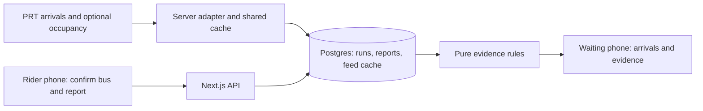

# Proposed architecture: bus boarding evidence

Read [PROJECT](PROJECT.md) first. Recommended baseline: **one Next.js/TypeScript mobile web app, one Supabase Postgres database, one deployment**. This is a design, not an implemented or tested runtime. The lead may adapt the stack once to the team's actual expertise before scaffolding; all lanes share the resulting decision.



## Resolve the data risk first

PRT publishes developer resources for GTFS, real-time feeds, and an API requiring an access request. Its indexed BusTime v3 guide describes vehicle/trip identifiers and a passenger-load field, but **we have not authenticated against the live API or verified that PRT populates occupancy**. A documented field is not proof of current usable data. [PRT resources](https://www.rideprt.org/business-center/developer-resources/), [BusTime guide](https://realtime.portauthority.org/bustime/apidoc/docs/DeveloperAPIGuide3_0.pdf).

| Approach | Decision |
| --- | --- |
| Agency vehicle/ETA data plus available occupancy and explicit rider reports | Recommended: avoids recreating arrival prediction; supports useful contributions with a small pilot. |
| Passive app location as a passenger counter | Exclude: tracks participating devices, not all passengers; adoption and vehicle matching remain unsolved. |
| New bus-mounted sensors/cameras or a custom capacity model | Exclude from this event: hardware/data access and validation are not established. |

The lead's first spike must capture a sanitized real response, actual field mapping, service-day/run identity, source timestamps, coverage, rate limits, and one origin/destination pair. Inspect occupancy values and missing-value semantics. GTFS-Realtime occupancy is optional; never decode an absent field as an empty vehicle. [GTFS reference](https://gtfs.org/documentation/realtime/reference/#message-vehicleposition).

If access is delayed after 20–30 minutes, publish the fixture contract and unblock both builders. A labeled demo adapter exercises the same pipeline. If occupancy is absent but identity/ETAs work, use actual rider reports. If live identity is unresolved, restrict reporting to clearly synthetic demo runs until fixed; never attach observations to an arbitrary route or guessed bus.

## Runtime and data flow

- Mobile browser uses explicit stop selection and large arrival cards. Optional foreground location only suggests candidates; retain manual selection. No native app, background tracker, login flow, or map dependency is needed for the first proof.
- The server fetches/caches pilot arrivals and available vehicle data. Keep keys server-side. Start with a 20-second upstream refresh target, adjusted to verified limits. Use one shared cache and a database refresh lease per pilot query so concurrent clients do not multiply upstream requests. Bound upstream requests to five seconds; stale cache stays visibly stale.
- Clients poll our board endpoint every five seconds and immediately after their own report. Ordinary HTTP and shared database persistence suffice. A second client must see the result; module memory is not shared durable storage across deployments.
- Postgres stores current runs, short-lived reports, and the shared feed cache. The server validates allowed pilot IDs and writes; browser clients receive no database service credential. Scope reports to a run and expire their influence, including when the bus starts another trip.
- Use a random server-issued session cookie for basic duplicate control, request-ID idempotency, and a small server-enforced write limit. Multiple sessions are not verified independent people. Do not claim fraud resistance or statistical confidence from report counts.

## Shared contract before parallel code

The lead creates `src/lib/contracts.ts` and a matching fixture before consumers diverge. The following is the proposed wire contract; after implementation, that code file is canonical. IDs are opaque strings, dates are ISO UTC, service dates use the agency's local timezone, and `null` means unknown. Do not rename fields independently.

```ts
type Crowding = "seats" | "standing" | "full" | "unknown";
type BoardResponse = {
  mode: "live" | "demo";
  fetchedAt: string;
  stopId: string;
  destinationStopId: string;
  arrivals: Array<{
    runKey: string;
    vehicleId: string;
    routeId: string;
    headsign: string;
    expectedAt: string | null;
    arrivalKind: "realtime" | "scheduled" | "unknown";
    vehicleObservedAt: string | null;
    crowding: Crowding;
    evidenceState: "none" | "single" | "multiple" | "conflicting" | "stale";
    evidence: Array<{
      source: "agency" | "rider";
      kind: "crowding" | "pass_up";
      crowding: Crowding;
      observedAt: string;
      stopId: string | null;
    }>;
  }>;
};
type ReportRequest = {
  requestId: string;
  runKey: string;
  stopId: string;
  kind: "crowding" | "pass_up";
  crowding?: "seats" | "standing" | "full";
};
```

- `GET /api/board?stopId=...&destinationStopId=...` returns `BoardResponse`, ETA-ordered, with only departures confirmed to serve both stops in order. Never rank an incompatible route as an alternative. Empty arrivals are a valid state.
- `POST /api/reports` accepts `ReportRequest`; return `{ reportId, acceptedAt }`. Require `crowding` only for crowding reports and forbid it for pass-ups. Server assigns receipt/observation time for immediate reports and verifies a known active run/stop association. A retry with the same request ID returns the existing result and does not refresh its timestamp.
- Errors use `{ error: { code, message, retryable } }`: HTTP 400 invalid input, 409 unknown/expired run, 429 rate limit, 503 unavailable data without usable cache. The UI must distinguish provider failure from no buses.
- Suggested `runKey`: provider + vehicle ID + provider trip ID + service date, verified against actual data. Vehicle number or route alone is insufficient. Preserve feed identity and observed timestamps; polling time must not make old evidence fresh.
- Keep one current crowding report per session/run and one pass-up per session/run/stop; replacement updates the observation, retries do not. Database uniqueness prevents duplicate concurrent submissions. Reports never transfer between live and demo namespaces or successive trips.

## Evidence rules: explicit, testable defaults

Use a pure function receiving normalized arrival, evidence, stop order, and an injected clock. Initial TTLs: **agency occupancy 90 seconds, rider evidence five minutes**. These are prototype constants, not measured reliability claims. Evidence must belong to the exact run; downstream or unknown-position rider reports cannot drive an upstream stop's decision.

Reject expired evidence from current status. Fresh conflicting crowding categories yield `unknown/conflicting` and show the observations. Otherwise use the available fresh category and show whether it came from one or multiple reports; no reports yields `unknown/none`. Retain timestamps so old reports can be labeled stale. A pass-up is a separate event badge, never silently converted into `full`.

Say “Full reported 2 minutes ago; next comparable departure in 8 minutes,” not “This bus will skip you.” Never turn `unknown` into available capacity or treat `standing` as a guaranteed refusal. Current crowding may change before arrival. Compare evidence; no boarding probability, expected wait reduction, or confidence percentage without validation.

## Verification and setup handoff

Lead owns app shell, API/storage wiring, shared types, migrations, fixtures, dependency lock, and deployment. Builder paths are in `PROJECT`. Pin runtime/package versions during scaffold creation. Install/dev/build/test/deploy commands and environment values are **not configured yet**; replace this paragraph with actual commands once they exist.

Expected server configuration: `PRT_API_KEY` if required, verified `PRT_API_BASE_URL`, `SUPABASE_URL`, `SUPABASE_SERVICE_ROLE_KEY`, and `DATA_MODE=live|demo`. Keep secret values outside Git and browser bundles. Scope development data and demo data separately; only the lead migrates the shared database.

Acceptance checks: a report for bus A never changes bus B or A's next trip; retry and concurrent duplicates count once; expired/conflicting/missing evidence stays honest; pass-up does not fabricate fullness; provider outage cannot display invented ETAs; incompatible destinations are excluded; two clients share the same persisted update; live/demo modes stay separate. These are tests to implement, not checks already passed.
